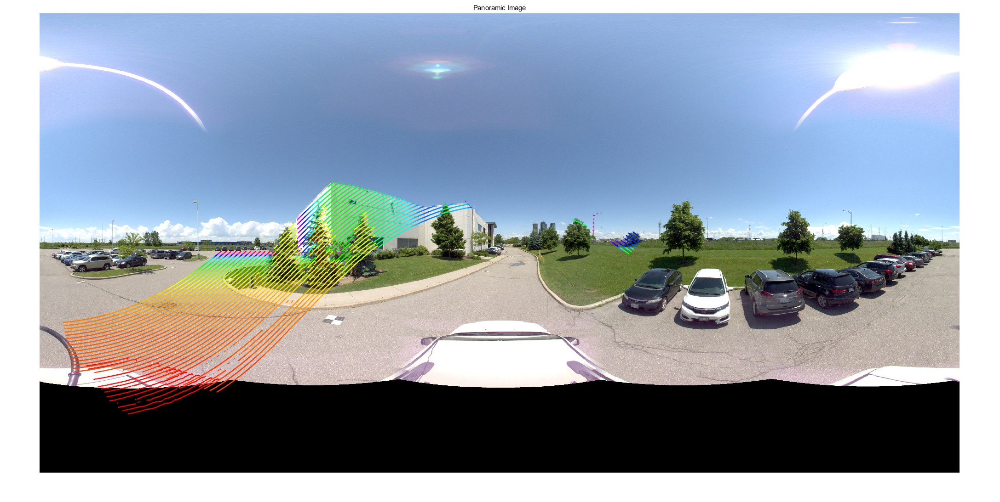

# MaverickProjectLidar2Image
**Author:** Yujia Zhang

**Main page of our dataset:** [YUTO MMS](https://ausmlab.github.io/yutomms/)

**Main page of our group:** [AUSM Lab](https://gunhosohn.me/)

## **Paper**

[**Zhang Y, Ahmadi S, Kang J, Arjmandi Z, Sohn G. YUTO MMS: A comprehensive SLAM dataset for urban mobile mapping with tilted LiDAR and panoramic camera integration. The International Journal of Robotics Research. 2024;0(0). doi:10.1177/02783649241261079**](https://journals.sagepub.com/doi/10.1177/02783649241261079)  

```markdown
@article{doi:10.1177/02783649241261079,
author = {Yiujia Zhang and SeyedMostafa Ahmadi and Jungwon Kang and Zahra Arjmandi and Gunho Sohn},
title ={YUTO MMS: A comprehensive SLAM dataset for urban mobile mapping with tilted LiDAR and panoramic camera integration},
journal = {The International Journal of Robotics Research},
volume = {0},
number = {0},
pages = {02783649241261079},
year = {0},
doi = {10.1177/02783649241261079},
URL = {https://doi.org/10.1177/02783649241261079},
eprint = {https://doi.org/10.1177/02783649241261079}
}
```

## Main description
This is a Matlab script that projects the lidar 3d point cloud onto the panoramic image for the [Maverick Mobile Mapping System](http://www.teledyneoptech.com/en/products/mobile-survey/maverick/).
The calibration estimates the intrinsics of the ladybug camera, the boresight and level-arm parameters between lidar and ladybug camera. 

## Example
Run "maverick_project_3D_pointcloud_to_images.m" after downloading the YUTO MMS dataset. 

Output: the panoramic image mapped with lidar 3d point cloud, the colors represent the depth range.
<center>
    <a href="https://github.com/yujiazhang777/MaverickProjectLidar2Image/tree/master/mapping_result.jpg">
        
      </a>
</center>